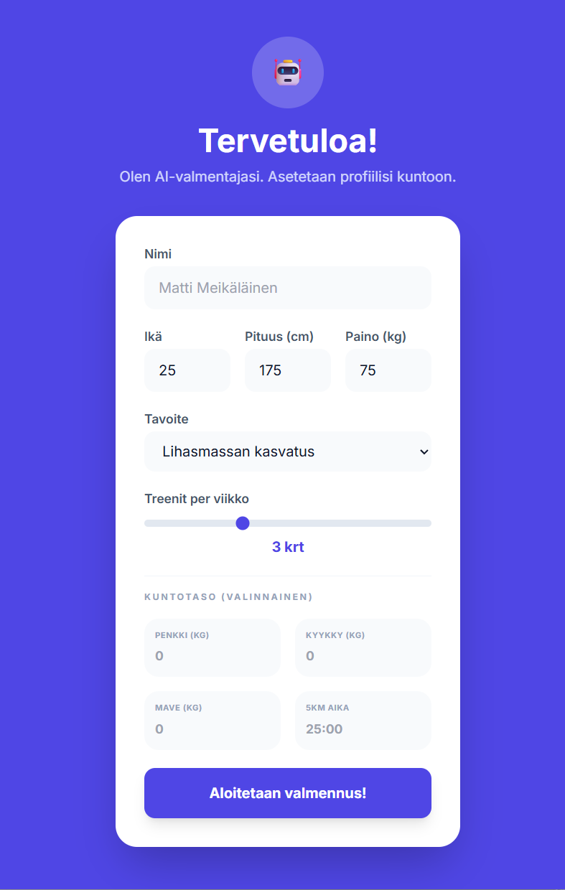

# TreeniTrack Pro 🏋️‍♂️

**Älykäs AI-pohjainen treenipäiväkirja Arnold Schwarzeneggerin filosofialla**



---

## 📋 Sisällysluettelo

- [Yleiskatsaus](#-yleiskatsaus)
- [Ominaisuudet](#-ominaisuudet)
- [Teknologia](#-teknologia)
- [Arkkitehtuuri](#-arkkitehtuuri)
- [Asennus ja käyttöönotto](#-asennus-ja-käyttöönotto)
- [Käyttö](#-käyttö)
- [AI-valmentaja](#-ai-valmentaja)
- [Tietorakenteet](#-tietorakenteet)
- [Lisenssi](#-lisenssi)

---

## 🎯 Yleiskatsaus

TreeniTrack Pro on moderni, tekoälypohjainen treenipäiväkirjasovellus, joka yhdistää helpon käytettävyyden ja huipputeknologian. Sovellus on rakennettu **Arnold Schwarzeneggerin** legendaaristen treeni- ja ravintoperiaatteiden ympärille, tarjoten käyttäjille aidon personal trainer -kokemuksen.

### Miksi TreeniTrack Pro?

- 🤖 **AI-valmentaja Google Gemini 2.5 Flash -mallilla** - Henkilökohtainen tekoälyvalmentaja, joka analysoi treenisi ja antaa räätälöityjä neuvoja Arnold Schwarzeneggerin filosofian mukaisesti
- 📊 **Kattava seuranta** - Treenit, painonhallinta, ravinto ja edistyminen yhdessä paikassa
- 🔒 **Yksityisyys edellä** - Kaikki data tallennetaan paikallisesti selaimeen, ei pilvipalveluita
- 📱 **Responsiivinen** - Toimii saumattomasti kaikilla laitteilla
- 🎨 **Moderni käyttöliittymä** - Intuitiivinen ja visuaalisesti miellyttävä

---

## ✨ Ominaisuudet

### 🏋️ Treenien kirjaaminen

- **Monipuolinen harjoitusseuranta**: Voimaharjoittelu, kardio ja muut harjoitustyypit
- **Yksityiskohtainen kirjaus**: Painot, toistot, sarjat, kesto, matka
- **Ravintotietojen lisäys**: Kalorit ja proteiini treenin yhteydessä
- **Treenihistoria**: Kaikki treenit aikajärjestyksessä, helppo poistaa ja tarkastella

### 🤖 AI-valmentaja (Google Gemini 2.5 Flash)

TreeniTrack Pro hyödyntää Google Geminin uusinta 2.5 Flash -mallia tarjotakseen:

#### Automaattinen analyysi
- **Treenianalyysi**: AI analysoi viimeisimmät 5 treeniä ja antaa palautetta
- **Ravintoneuvonta**: Henkilökohtaiset ravinto-ohjeet tavoitteesi mukaan
- **Kuntoanalyysi**: BMI-laskenta ja kuntotilastojen arviointi
- **Arnold-mindset**: Kaikki palaute perustuu Arnold Schwarzeneggerin periaatteisiin

#### Interaktiivinen chat
- **Keskustelu valmentajan kanssa**: Kysy mitä tahansa treenaamisesta, ravinnosta tai hyvinvoinnista
- **Kontekstuaalinen muisti**: AI muistaa keskustelun historian
- **Säikeiden hallinta**: Luo useita keskustelusäikeitä eri aiheista
- **Markdown-muotoilu**: Selkeästi jäsennellyt vastaukset

#### Arnold Schwarzeneggerin filosofia

AI-valmentaja noudattaa Arnoldin legendaarisia periaatteita:

**Treenifilosofia:**
- Korkea volyymi (High Volume) ja intensiteetti
- Supersetit vastakkaisille lihasryhmille (rinta/selkä)
- "Golden Six" aloittelijoille: Kyykky, Penkki, Leuanveto, Pystypunnerrus, Hauiskääntö, Istumaannousu
- Pyramiditaktiikka (paino nousee, toistot laskee)
- Visualisointi ja lihastuntuma (Iso-Tension)

**Ravinto:**
- Korkea proteiini, matalat hiilihydraatit
- Puhdas ruoka: Naudanliha, munat, kana, kala, raejuusto
- Rasvat energiana
- "Mättöpäivä" kerran viikossa henkisen kestävyyden vuoksi

**Mindset:**
- Kurinalaisuus ja "rugged fighter" -asenne
- Lihastuntuma ja supistus
- Periksiantamattomuus

### 📊 Dashboard ja tilastot

- **Viikkokalenteri**: Visuaalinen näkymä viikon treeneistä
- **Treenivolyymikaavio**: Pylväsdiagrammi viimeisimmistä 10 treenistä
- **Painonkehitys**: Viivakaaviokuvaaja painon muutoksista
- **Tavoiteseuranta**: Viikoittainen treenimäärä ja edistyminen
- **BMI-laskuri**: Automaattinen BMI-seuranta
- **Kuntotilastot**: Max-painot (penkkipunnerrus, kyykky, maastaveto) ja juoksuajat

### 🎯 Treeniohjelmat

- **AI-generoidut ohjelmat**: Tekoäly luo henkilökohtaisen ohjelman tavoitteesi mukaan
- **Viikkosuunnittelu**: Määritä treenipäivät viikolle
- **Yksityiskohtaiset treenit**: Liikkeet, sarjat, toistot ja Arnold-vinkit
- **Ohjelmaseuranta**: Näe aktiivinen ohjelma ja seuraa edistymistä
- **Muokattavuus**: Päivitä ohjelmaa keskustelemalla AI-valmentajan kanssa

### 👤 Profiili ja asetukset

- **Henkilötiedot**: Nimi, ikä, pituus, paino
- **Tavoitteen asetus**: Lihasmassan kasvatus, voimaharjoittelu, painonpudotus, ylläpito, kuntoilu
- **Viikkotavoite**: Aseta tavoitetreenimäärä
- **Kuntotilastot**: Tallenna max-painot ja juoksuajat
- **Painohistoria**: Automaattinen seuranta painon muutoksista
- **AI-analyysin päivitys**: Pyydä uusi analyysi milloin tahansa
- **Datan nollaus**: Aloita alusta tarvittaessa

### 🔐 Turvallisuus

- **PIN-suojaus**: Valinnainen PIN-koodi sovelluksen lukitsemiseen
- **Session-pohjainen**: Lukitus päättyy selaimen sulkemisen yhteydessä
- **Paikallinen tallennus**: Kaikki data localStorage:ssa, ei pilvipalveluita

### 📱 Käyttöliittymä

- **Responsiivinen design**: Optimoitu mobiilille, tabletille ja työpöydälle
- **Moderni ulkoasu**: Tailwind CSS -pohjainen, tyylikäs ja selkeä
- **Intuitiivinen navigaatio**: Helppo liikkua eri näkymien välillä
- **Animaatiot**: Pehmeät siirtymät ja visuaaliset palautteet
- **Ikonigrafia**: Lucide React -ikonit selkeyden lisäämiseksi

---

## 🛠️ Teknologia

### Frontend Stack

| Teknologia | Versio | Käyttötarkoitus |
|------------|--------|-----------------|
| **React** | 19.2.3 | Käyttöliittymäkirjasto |
| **TypeScript** | 5.0.0 | Tyyppiturvallinen kehitys |
| **Vite** | 7.3.0 | Nopea build-työkalu ja dev server |
| **Tailwind CSS** | 3.4.0 | Utility-first CSS framework |
| **Lucide React** | 0.562.0 | Modernit SVG-ikonit |
| **Recharts** | 3.6.0 | Interaktiiviset kaaviot ja tilastot |

### AI ja Backend

| Teknologia | Versio | Käyttötarkoitus |
|------------|--------|-----------------|
| **Google Gemini AI** | @google/genai 1.34.0 | AI-valmentaja (Gemini 2.5 Flash) |

### Kehitystyökalut

| Teknologia | Versio | Käyttötarkoitus |
|------------|--------|-----------------|
| **@vitejs/plugin-react** | 5.1.2 | React-tuki Vitelle |
| **Autoprefixer** | 10.4.23 | CSS vendor prefixes |
| **PostCSS** | - | CSS-prosessointi |
| **@types/node** | 25.0.3 | Node.js TypeScript-tyypit |

---

## 🏗️ Arkkitehtuuri

### Projektirakenne

```
treenitrack/
├── api/                 # Serverless backend
│   ├── chat.ts          # Tekoälychatin reitti
│   ├── feedback.ts      # Palaute-tekoälyn reitti
│   ├── program.ts       # Ohjelma-tekoälyn reitti
│   └── verify_password.ts # Salasanatarkistuksen reitti
├── src/
│   ├── components/      # React-komponentit
│   ├── AIChat.tsx       # AI-keskustelukomponentti
│   ├── Dashboard.tsx    # Pääkojelauta
│   ├── History.tsx      # Treenihistoria
│   ├── LockScreen.tsx   # PIN-lukitusnäyttö
│   ├── Navigation.tsx   # Alanavigaatio
│   ├── Onboarding.tsx   # Ensikäyttöönotto
│   ├── Profile.tsx      # Käyttäjäprofiili
│   ├── ProgramView.tsx  # Treeniohjelmanäkymä
│   ├── WeekCalendar.tsx # Viikkokalenteri
│   └── WorkoutLogger.tsx # Treenin kirjaus
├── services/            # Palvelut
│   └── aiService.ts     # Google Gemini AI -integraatio
├── documents/           # Dokumentaatio
│   └── arnold.md        # Arnold-filosofian lähdemateriaali
├── assets/              # Staattiset tiedostot
│   └── screenshot.png   # Sovelluksen kuvakaappaus
├── public/              # Julkiset tiedostot
├── App.tsx              # Pääsovellus
├── types.ts             # TypeScript-tyyppimäärittelyt
├── index.tsx            # Sovelluksen aloituspiste
├── index.css            # Globaalit tyylit
├── vite.config.ts       # Vite-konfiguraatio
├── tailwind.config.js   # Tailwind-konfiguraatio
├── tsconfig.json        # TypeScript-konfiguraatio
└── package.json         # Projektin riippuvuudet
```

### Tyyppimäärittelyt (types.ts)

Sovellus käyttää vahvaa TypeScript-tyypitystä:

- **UserProfile**: Käyttäjän profiilin tiedot (nimi, ikä, paino, tavoite, painohistoria, kuntotilastot)
- **WorkoutSession**: Yksittäinen treeni (päivämäärä, nimi, liikkeet, ravinto)
- **Exercise**: Yksittäinen liike (nimi, tyyppi, painot, toistot, sarjat, kesto, matka)
- **TrainingProgram**: Treeniohjelma (nimi, tavoite, viikko-ohjelma, treenit)
- **ChatThread**: Keskustelusäie (otsikko, viestit, päivämäärä)
- **AIFeedback**: AI-palaute (analyysi, treeni- ja ravintovinkit)
- **GoalType**: Tavoitetyypit (enum)
- **ExerciseType**: Harjoitustyypit (strength, cardio, other)
- **WeekDay**: Viikonpäivät (ma-su)

### Tiedon tallennus

Sovellus käyttää selaimen **localStorage** ja **sessionStorage** -rajapintoja:

- `localStorage.treenitrack_profile` - Käyttäjäprofiili
- `localStorage.treenitrack_workouts` - Treenihistoria
- `localStorage.treenitrack_chat_threads` - AI-keskustelut
- `localStorage.treenitrack_program` - Aktiivinen treeniohjelma
- `sessionStorage.treenitrack_unlocked` - Lukituksen tila

### AI-palvelu (aiService.ts)

Kolme pääfunktiota:

1. **generateTrainerFeedback()**: Analysoi käyttäjän treenit ja antaa palautetta
2. **generateChatResponse()**: Käsittelee keskustelun AI-valmentajan kanssa
3. **generateTrainingProgram()**: Luo henkilökohtaisen treeniohjelman

Kaikki funktiot hyödyntävät Arnold Schwarzeneggerin periaatteita ja palauttavat JSON-muotoista dataa.

---

## 🚀 Asennus ja käyttöönotto

### Vaatimukset

- **Node.js** (versio 18 tai uudempi)
- **npm** tai **yarn**
- **Google Gemini API -avain** (ilmainen: [Google AI Studio](https://aistudio.google.com/))

### Asennusohjeet

1. **Kloonaa repositorio**

```bash
git clone https://github.com/yourusername/treenitrack.git
cd treenitrack
```

2. **Asenna riippuvuudet**

```bash
npm install
```

3. **Konfiguroi ympäristömuuttujat**

Luo `.env` tiedosto projektin juureen:

```bash
cp .env.example .env
```

Muokkaa `.env` tiedostoa ja lisää Google Gemini API -avaimesi:

```env
VITE_GEMINI_API_KEY=your_actual_api_key_here
GEMINI_API_KEY=your_actual_api_key_here
VITE_APP_PASSWORD=optional_pin_code_for_lock_screen
APP_PASSWORD=optional_pin_code_for_lock_screen
```

**Huom:** Sovelluksen salasanan voi asettaa joko `VITE_APP_PASSWORD` tai `APP_PASSWORD` -muuttujaan, se on turvassa taustapalvelimella. API-avaimet toimivat samoin.

4. **Käynnistä kehityspalvelin**

```bash
# Asenna Vercel CLI (vain ensimmäisellä kerralla)
npm install -g vercel

# Käynnistä kehityspalvelin turvallisten taustatoimintojen kera
vercel dev
```

Sovellus käynnistyy osoitteessa `http://localhost:3000`.

5. **Rakenna tuotantoversio**

```bash
npm run build
```

Valmis sovellus löytyy `dist/` kansiosta.

6. **Esikatsele tuotantoversio**

```bash
npm run preview
```

---

## 💡 Käyttö

### Ensikäyttöönotto

1. **Avaa sovellus** selaimessa
2. **Täytä profiilitiedot**: Nimi, ikä, pituus, paino
3. **Valitse tavoite**: Lihasmassan kasvatus, voimaharjoittelu, painonpudotus, ylläpito tai kuntoilu
4. **Aseta viikkotavoite**: Kuinka monta kertaa viikossa haluat treenata
5. **Valmis!** AI-valmentaja analysoi tietosi ja antaa ensimmäisen palautteen

### Treenin kirjaaminen

1. **Navigoi** "Lisää treeni" -näkymään (+ -kuvake)
2. **Anna treenille nimi** (esim. "Rintalihastreeni")
3. **Lisää liikkeet**:
   - Valitse tyyppi (voima/kardio/muu)
   - Kirjaa tiedot (painot, toistot, sarjat, kesto, matka)
4. **Lisää ravintotiedot** (valinnainen): Kalorit ja proteiini
5. **Tallenna** - AI analysoi treenin automaattisesti

### AI-valmentajan käyttö

#### Dashboard-palaute
- AI antaa automaattisen palautteen jokaisen treenin jälkeen
- Näet analyysin, treenivinkin ja ravintovinkin Dashboard-näkymässä
- Päivitä analyysi milloin tahansa Profiili-näkymästä

#### Chat-keskustelu
1. **Avaa Chat-näkymä** (💬 -kuvake)
2. **Kirjoita kysymyksesi** (esim. "Miten parannan penkkipunnerrustani?")
3. **AI vastaa** Arnold-mindsetilla
4. **Luo uusia säikeitä** eri aiheille
5. **Pyydä ohjelman päivityksiä** keskustelussa

#### Treeniohjelman luominen
1. **Avaa Ohjelma-näkymä** (📋 -kuvake)
2. **Klikkaa "Luo AI-ohjelma"**
3. **AI generoi** henkilökohtaisen ohjelman tavoitteesi mukaan
4. **Tarkastele** liikkeitä, sarjoja ja Arnold-vinkkejä
5. **Muokkaa** tarvittaessa Chat-näkymässä

---

## 🤖 AI-valmentaja

### Gemini 2.5 Flash -malli

TreeniTrack Pro käyttää Googlen uusinta **Gemini 2.5 Flash** -mallia, joka tarjoaa:

- ⚡ **Nopeat vastaukset** - Optimoitu suorituskyky
- 🧠 **Kontekstuaalinen ymmärrys** - Muistaa keskusteluhistorian
- 📊 **Strukturoitu data** - JSON-muotoinen palaute
- 🎯 **Räätälöity sisältö** - Arnold-filosofian mukainen coaching

### AI:n rajoitukset

AI-valmentaja on ohjelmoitu **keskittymään ainoastaan**:
- ✅ Treenaamiseen
- ✅ Ravintoon
- ✅ Hyvinvointiin
- ✅ Liikuntaan

AI **kieltäytyy** vastaamasta:
- ❌ Ei-terveyteen liittyviin kysymyksiin
- ❌ Yleisiin tietokyselyihin
- ❌ Muihin aiheisiin

### Virheenkäsittely

Jos AI-palvelu ei ole saatavilla:
- Sovellus jatkaa toimintaa normaalisti
- Näytetään ystävällinen virheilmoitus
- Kaikki muu toiminnallisuus säilyy

---

## 📊 Tietorakenteet

### UserProfile

```typescript
{
  name: string;
  age: number;
  height: number;
  weight: number;
  goal: GoalType;
  targetWorkoutsPerWeek: number;
  isSetup: boolean;
  aiTrainerNote?: string;
  aiStructuredFeedback?: AIFeedback;
  weightHistory?: WeightEntry[];
  fitnessStats?: {
    benchPressMax?: number;
    squatMax?: number;
    deadliftMax?: number;
    running5kmTime?: string;
  };
}
```

### WorkoutSession

```typescript
{
  id: string;
  date: string;
  name: string;
  exercises: Exercise[];
  calories?: number;
  protein?: number;
}
```

### TrainingProgram

```typescript
{
  id: string;
  name: string;
  goal: GoalType;
  weeklySchedule: WeekDay[];
  workouts: ProgramWorkout[];
  createdAt: string;
  isAIGenerated: boolean;
}
```

---

## 🎨 Käyttöliittymän ominaisuudet

### Responsiivisuus

- **Mobiili-first**: Optimoitu ensisijaisesti mobiililaitteille
- **Max-leveys**: 448px (md breakpoint) työpöytänäkymässä
- **Flexbox-layout**: Joustava ja mukautuva rakenne

### Värimaailma

- **Pääväri**: Indigo (600, 500, 50)
- **Tekstit**: Slate (800, 600, 400)
- **Taustat**: Valkoinen, harmaan sävyt
- **Aksentit**: Vihreä (edistyminen), punainen (varoitukset)

### Animaatiot

- **Fade-in**: Näkymien vaihdot
- **Pulse**: Latausanimaatiot
- **Hover-efektit**: Painikkeet ja interaktiiviset elementit
- **Smooth transitions**: Kaikki tilamuutokset

---

## 📜 Lisenssi

**MIT License**

Tämä projekti on ensisijaisesti **portfolionäyte** teknisestä osaamisesta ja arkkitehtuurisesta kyvykkyydestä.

### Huomioitavaa

1. **Henkilökohtainen projekti**: Suunnittelu, tekstit ja toteutus on räätälöity henkilökohtaista portfoliota varten
2. **Ei kaupallista käyttöä**: Älä käytä tätä sovellusta kaupallisiin tarkoituksiin ilman lupaa
3. **Lähdekoodi julkinen**: Koodi on julkista oppimis- ja arviointitarkoituksiin
4. **Arnold-materiaali**: Arnold Schwarzeneggerin filosofia perustuu julkisiin lähteisiin ja artikkeleihin

### Yhteydenotot

Liiketoimintatiedusteluissa tai yhteistyöehdotuksissa, ota yhteyttä LinkedInin kautta.

---

## 🙏 Kiitokset

- **Arnold Schwarzenegger** - Inspiraatio ja treenifilosofia
- **Google Gemini** - Tekoälyteknologia
- **React-yhteisö** - Upeat työkalut ja kirjastot
- **Tailwind CSS** - Moderni CSS-framework

---

<p align="center">
  <b>TreeniTrack Pro</b> – Treeniä älykkäämmin, ei kovemmin. 💪
</p>

<p align="center">
  <i>"The mind is the limit. As long as the mind can envision the fact that you can do something, you can do it."</i><br>
  – Arnold Schwarzenegger
</p>
